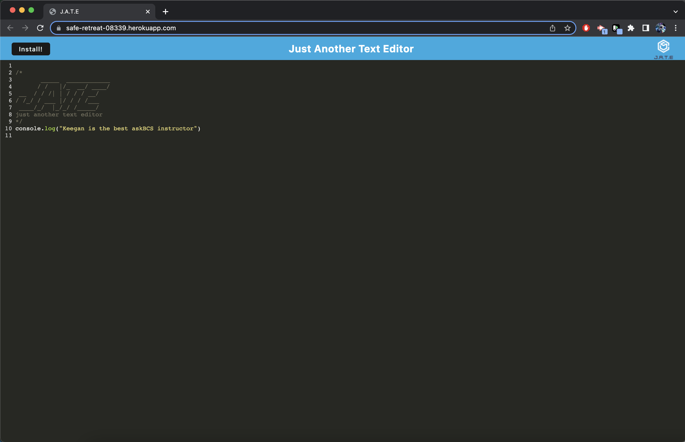
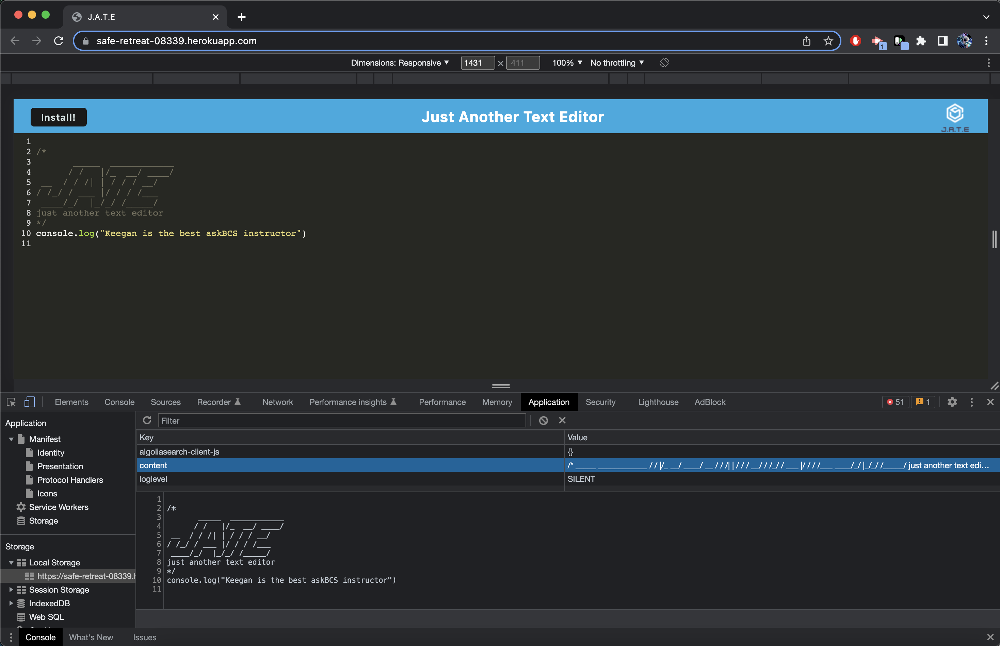
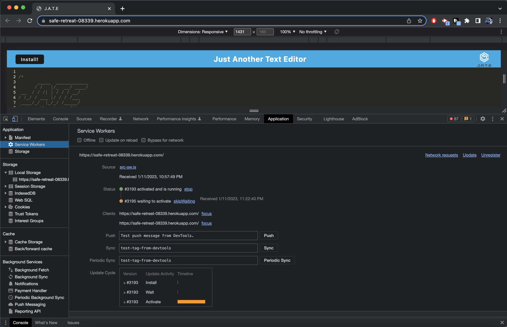
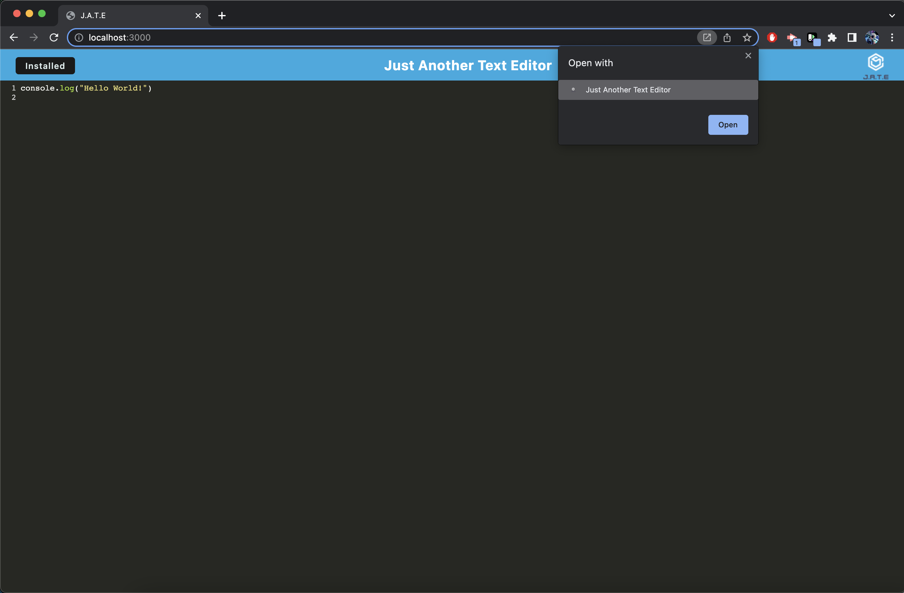
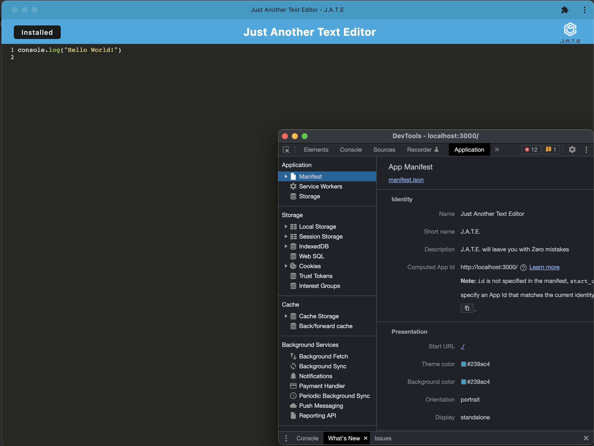

# Just Another Text Editor
[](https://perso.crans.org/) 

J.A.T.E. or Just Another Text Editor is a web text editor built with Webpack. It can be downloaded and installed to your computer for offline use.

[Use J.A.T.E.!](https://safe-retreat-08339.herokuapp.com/)

## Table of Contents

- [Installation](#installation)
- [Usage and Testing](#usage-and-test)
- [Screenshots](#screenshots)
- [Contact me](#contact)

## Installation

In the console under the file that package.json is:
```
npm i
```

## Usage and Test

**After the _npm_ has been installed** 

To get dist folder:
```
npm run build
```

To initialize server:
```
npm run start:dev
```
or 

```
npm run start
```

Now listening http://localhost:3000

## Screenshots


##

##

##

##


## Contact Me
- Github: [JBlay10](https://github.com/JBlay10)
- Email: joseblay10@gmail.com


